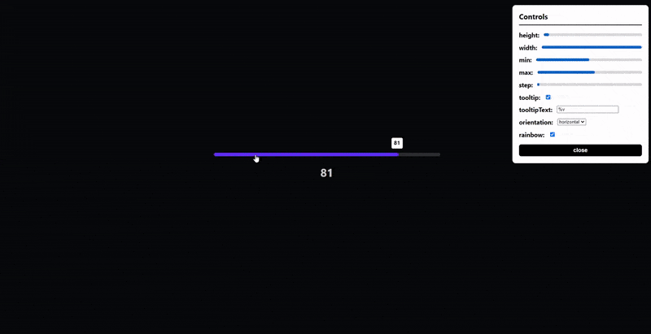

# 🔥 Vue 3 Slider 🔥

## Table of Contents 📰

* [Demo](#demo)
* [Installation](#installation)
* [Getting Started](#getting-started)
  * [Import Component](#import-component)
  * [How to use](#how-to-use)
* [License](#license)
* [Contact](#contact)

## Demo



## Installation 
```js
# npm
npm install vue3-slider
```

```js
# yarn 
yarn add vue3-slider
```

## Getting Started 👍

### Import component
```js
import slider from "vue3-slider"

export default {
  ...
  components: {
    "vue3-slider": slider
  }
  ...
}
```

### How to use
```html
<vue3-slider
  v-model="myNumber"
  color="#FB278D"
  track-color="#FEFEFE"
>
```

## License

[MIT](https://opensource.org/licenses/MIT)

Copyright © 2020 - Present, Freddie Nelson

## Contact

* [Send me an email 📧](mailto:freddie0208@hotmail.com)
* [DM me through twitter](https://twitter.com/freddie_dev)
* [Contact me through my website](https://freddienelson.co.uk)